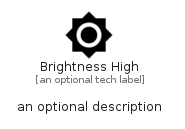

# BrightnessHigh


```text
material/Device/BrightnessHigh
```

```text
include('material/Device/BrightnessHigh')
```


| Illustration | BrightnessHigh |
| :---: | :---: |
|  |  |


## Sprites
The item provides the following sriptes:

- `<$BrightnessHighXs>`
- `<$BrightnessHighSm>`
- `<$BrightnessHighMd>`
- `<$BrightnessHighLg>`


## BrightnessHigh

### Load remotely
```plantuml
@startuml
' configures the library
!global $LIB_BASE_LOCATION="https://raw.githubusercontent.com/tmorin/plantuml-libs/master/distribution"

' loads the library's bootstrap
!include $LIB_BASE_LOCATION/bootstrap.puml

' loads the package bootstrap
include('material/bootstrap')

' loads the Item which embeds the element BrightnessHigh
include('material/Device/BrightnessHigh')

' renders the element
BrightnessHigh('BrightnessHigh', 'Brightness High', 'an optional tech label', 'an optional description')
@enduml
```

### Load locally
```plantuml
@startuml
' configures the library
!global $INCLUSION_MODE="local"
!global $LIB_BASE_LOCATION="../.."

' loads the library's bootstrap
!include $LIB_BASE_LOCATION/bootstrap.puml

' loads the package bootstrap
include('material/bootstrap')

' loads the Item which embeds the element BrightnessHigh
include('material/Device/BrightnessHigh')

' renders the element
BrightnessHigh('BrightnessHigh', 'Brightness High', 'an optional tech label', 'an optional description')
@enduml
```

