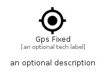

# GpsFixed


```text
material/Device/GpsFixed
```

```text
include('material/Device/GpsFixed')
```


| Illustration | GpsFixed |
| :---: | :---: |
|  |  |


## Sprites
The item provides the following sriptes:

- `<$GpsFixedXs>`
- `<$GpsFixedSm>`
- `<$GpsFixedMd>`
- `<$GpsFixedLg>`


## GpsFixed

### Load remotely
```plantuml
@startuml
' configures the library
!global $LIB_BASE_LOCATION="https://raw.githubusercontent.com/tmorin/plantuml-libs/master/distribution"

' loads the library's bootstrap
!include $LIB_BASE_LOCATION/bootstrap.puml

' loads the package bootstrap
include('material/bootstrap')

' loads the Item which embeds the element GpsFixed
include('material/Device/GpsFixed')

' renders the element
GpsFixed('GpsFixed', 'Gps Fixed', 'an optional tech label', 'an optional description')
@enduml
```

### Load locally
```plantuml
@startuml
' configures the library
!global $INCLUSION_MODE="local"
!global $LIB_BASE_LOCATION="../.."

' loads the library's bootstrap
!include $LIB_BASE_LOCATION/bootstrap.puml

' loads the package bootstrap
include('material/bootstrap')

' loads the Item which embeds the element GpsFixed
include('material/Device/GpsFixed')

' renders the element
GpsFixed('GpsFixed', 'Gps Fixed', 'an optional tech label', 'an optional description')
@enduml
```

