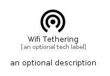

# WifiTethering


```text
material/Device/WifiTethering
```

```text
include('material/Device/WifiTethering')
```


| Illustration | WifiTethering |
| :---: | :---: |
|  |  |


## Sprites
The item provides the following sriptes:

- `<$WifiTetheringXs>`
- `<$WifiTetheringSm>`
- `<$WifiTetheringMd>`
- `<$WifiTetheringLg>`


## WifiTethering

### Load remotely
```plantuml
@startuml
' configures the library
!global $LIB_BASE_LOCATION="https://raw.githubusercontent.com/tmorin/plantuml-libs/master/distribution"

' loads the library's bootstrap
!include $LIB_BASE_LOCATION/bootstrap.puml

' loads the package bootstrap
include('material/bootstrap')

' loads the Item which embeds the element WifiTethering
include('material/Device/WifiTethering')

' renders the element
WifiTethering('WifiTethering', 'Wifi Tethering', 'an optional tech label', 'an optional description')
@enduml
```

### Load locally
```plantuml
@startuml
' configures the library
!global $INCLUSION_MODE="local"
!global $LIB_BASE_LOCATION="../.."

' loads the library's bootstrap
!include $LIB_BASE_LOCATION/bootstrap.puml

' loads the package bootstrap
include('material/bootstrap')

' loads the Item which embeds the element WifiTethering
include('material/Device/WifiTethering')

' renders the element
WifiTethering('WifiTethering', 'Wifi Tethering', 'an optional tech label', 'an optional description')
@enduml
```

