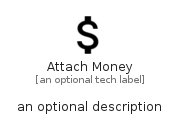

# AttachMoney


```text
material/Editor/AttachMoney
```

```text
include('material/Editor/AttachMoney')
```


| Illustration | AttachMoney |
| :---: | :---: |
|  |  |


## Sprites
The item provides the following sriptes:

- `<$AttachMoneyXs>`
- `<$AttachMoneySm>`
- `<$AttachMoneyMd>`
- `<$AttachMoneyLg>`


## AttachMoney

### Load remotely
```plantuml
@startuml
' configures the library
!global $LIB_BASE_LOCATION="https://raw.githubusercontent.com/tmorin/plantuml-libs/master/distribution"

' loads the library's bootstrap
!include $LIB_BASE_LOCATION/bootstrap.puml

' loads the package bootstrap
include('material/bootstrap')

' loads the Item which embeds the element AttachMoney
include('material/Editor/AttachMoney')

' renders the element
AttachMoney('AttachMoney', 'Attach Money', 'an optional tech label', 'an optional description')
@enduml
```

### Load locally
```plantuml
@startuml
' configures the library
!global $INCLUSION_MODE="local"
!global $LIB_BASE_LOCATION="../.."

' loads the library's bootstrap
!include $LIB_BASE_LOCATION/bootstrap.puml

' loads the package bootstrap
include('material/bootstrap')

' loads the Item which embeds the element AttachMoney
include('material/Editor/AttachMoney')

' renders the element
AttachMoney('AttachMoney', 'Attach Money', 'an optional tech label', 'an optional description')
@enduml
```

