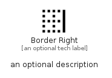

# BorderRight


```text
material/Editor/BorderRight
```

```text
include('material/Editor/BorderRight')
```


| Illustration | BorderRight |
| :---: | :---: |
|  |  |


## Sprites
The item provides the following sriptes:

- `<$BorderRightXs>`
- `<$BorderRightSm>`
- `<$BorderRightMd>`
- `<$BorderRightLg>`


## BorderRight

### Load remotely
```plantuml
@startuml
' configures the library
!global $LIB_BASE_LOCATION="https://raw.githubusercontent.com/tmorin/plantuml-libs/master/distribution"

' loads the library's bootstrap
!include $LIB_BASE_LOCATION/bootstrap.puml

' loads the package bootstrap
include('material/bootstrap')

' loads the Item which embeds the element BorderRight
include('material/Editor/BorderRight')

' renders the element
BorderRight('BorderRight', 'Border Right', 'an optional tech label', 'an optional description')
@enduml
```

### Load locally
```plantuml
@startuml
' configures the library
!global $INCLUSION_MODE="local"
!global $LIB_BASE_LOCATION="../.."

' loads the library's bootstrap
!include $LIB_BASE_LOCATION/bootstrap.puml

' loads the package bootstrap
include('material/bootstrap')

' loads the Item which embeds the element BorderRight
include('material/Editor/BorderRight')

' renders the element
BorderRight('BorderRight', 'Border Right', 'an optional tech label', 'an optional description')
@enduml
```

