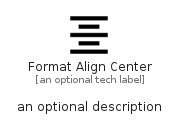

# FormatAlignCenter


```text
material/Editor/FormatAlignCenter
```

```text
include('material/Editor/FormatAlignCenter')
```


| Illustration | FormatAlignCenter |
| :---: | :---: |
|  |  |


## Sprites
The item provides the following sriptes:

- `<$FormatAlignCenterXs>`
- `<$FormatAlignCenterSm>`
- `<$FormatAlignCenterMd>`
- `<$FormatAlignCenterLg>`


## FormatAlignCenter

### Load remotely
```plantuml
@startuml
' configures the library
!global $LIB_BASE_LOCATION="https://raw.githubusercontent.com/tmorin/plantuml-libs/master/distribution"

' loads the library's bootstrap
!include $LIB_BASE_LOCATION/bootstrap.puml

' loads the package bootstrap
include('material/bootstrap')

' loads the Item which embeds the element FormatAlignCenter
include('material/Editor/FormatAlignCenter')

' renders the element
FormatAlignCenter('FormatAlignCenter', 'Format Align Center', 'an optional tech label', 'an optional description')
@enduml
```

### Load locally
```plantuml
@startuml
' configures the library
!global $INCLUSION_MODE="local"
!global $LIB_BASE_LOCATION="../.."

' loads the library's bootstrap
!include $LIB_BASE_LOCATION/bootstrap.puml

' loads the package bootstrap
include('material/bootstrap')

' loads the Item which embeds the element FormatAlignCenter
include('material/Editor/FormatAlignCenter')

' renders the element
FormatAlignCenter('FormatAlignCenter', 'Format Align Center', 'an optional tech label', 'an optional description')
@enduml
```

