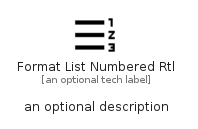

# FormatListNumberedRtl


```text
material/Editor/FormatListNumberedRtl
```

```text
include('material/Editor/FormatListNumberedRtl')
```


| Illustration | FormatListNumberedRtl |
| :---: | :---: |
|  |  |


## Sprites
The item provides the following sriptes:

- `<$FormatListNumberedRtlXs>`
- `<$FormatListNumberedRtlSm>`
- `<$FormatListNumberedRtlMd>`
- `<$FormatListNumberedRtlLg>`


## FormatListNumberedRtl

### Load remotely
```plantuml
@startuml
' configures the library
!global $LIB_BASE_LOCATION="https://raw.githubusercontent.com/tmorin/plantuml-libs/master/distribution"

' loads the library's bootstrap
!include $LIB_BASE_LOCATION/bootstrap.puml

' loads the package bootstrap
include('material/bootstrap')

' loads the Item which embeds the element FormatListNumberedRtl
include('material/Editor/FormatListNumberedRtl')

' renders the element
FormatListNumberedRtl('FormatListNumberedRtl', 'Format List Numbered Rtl', 'an optional tech label', 'an optional description')
@enduml
```

### Load locally
```plantuml
@startuml
' configures the library
!global $INCLUSION_MODE="local"
!global $LIB_BASE_LOCATION="../.."

' loads the library's bootstrap
!include $LIB_BASE_LOCATION/bootstrap.puml

' loads the package bootstrap
include('material/bootstrap')

' loads the Item which embeds the element FormatListNumberedRtl
include('material/Editor/FormatListNumberedRtl')

' renders the element
FormatListNumberedRtl('FormatListNumberedRtl', 'Format List Numbered Rtl', 'an optional tech label', 'an optional description')
@enduml
```

