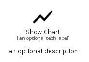

# ShowChart


```text
material/Editor/ShowChart
```

```text
include('material/Editor/ShowChart')
```


| Illustration | ShowChart |
| :---: | :---: |
|  |  |


## Sprites
The item provides the following sriptes:

- `<$ShowChartXs>`
- `<$ShowChartSm>`
- `<$ShowChartMd>`
- `<$ShowChartLg>`


## ShowChart

### Load remotely
```plantuml
@startuml
' configures the library
!global $LIB_BASE_LOCATION="https://raw.githubusercontent.com/tmorin/plantuml-libs/master/distribution"

' loads the library's bootstrap
!include $LIB_BASE_LOCATION/bootstrap.puml

' loads the package bootstrap
include('material/bootstrap')

' loads the Item which embeds the element ShowChart
include('material/Editor/ShowChart')

' renders the element
ShowChart('ShowChart', 'Show Chart', 'an optional tech label', 'an optional description')
@enduml
```

### Load locally
```plantuml
@startuml
' configures the library
!global $INCLUSION_MODE="local"
!global $LIB_BASE_LOCATION="../.."

' loads the library's bootstrap
!include $LIB_BASE_LOCATION/bootstrap.puml

' loads the package bootstrap
include('material/bootstrap')

' loads the Item which embeds the element ShowChart
include('material/Editor/ShowChart')

' renders the element
ShowChart('ShowChart', 'Show Chart', 'an optional tech label', 'an optional description')
@enduml
```

