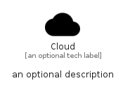

# Cloud


```text
material/File/Cloud
```

```text
include('material/File/Cloud')
```


| Illustration | Cloud |
| :---: | :---: |
|  |  |


## Sprites
The item provides the following sriptes:

- `<$CloudXs>`
- `<$CloudSm>`
- `<$CloudMd>`
- `<$CloudLg>`


## Cloud

### Load remotely
```plantuml
@startuml
' configures the library
!global $LIB_BASE_LOCATION="https://raw.githubusercontent.com/tmorin/plantuml-libs/master/distribution"

' loads the library's bootstrap
!include $LIB_BASE_LOCATION/bootstrap.puml

' loads the package bootstrap
include('material/bootstrap')

' loads the Item which embeds the element Cloud
include('material/File/Cloud')

' renders the element
Cloud('Cloud', 'Cloud', 'an optional tech label', 'an optional description')
@enduml
```

### Load locally
```plantuml
@startuml
' configures the library
!global $INCLUSION_MODE="local"
!global $LIB_BASE_LOCATION="../.."

' loads the library's bootstrap
!include $LIB_BASE_LOCATION/bootstrap.puml

' loads the package bootstrap
include('material/bootstrap')

' loads the Item which embeds the element Cloud
include('material/File/Cloud')

' renders the element
Cloud('Cloud', 'Cloud', 'an optional tech label', 'an optional description')
@enduml
```

