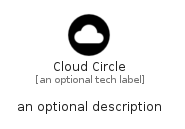

# CloudCircle


```text
material/File/CloudCircle
```

```text
include('material/File/CloudCircle')
```


| Illustration | CloudCircle |
| :---: | :---: |
|  |  |


## Sprites
The item provides the following sriptes:

- `<$CloudCircleXs>`
- `<$CloudCircleSm>`
- `<$CloudCircleMd>`
- `<$CloudCircleLg>`


## CloudCircle

### Load remotely
```plantuml
@startuml
' configures the library
!global $LIB_BASE_LOCATION="https://raw.githubusercontent.com/tmorin/plantuml-libs/master/distribution"

' loads the library's bootstrap
!include $LIB_BASE_LOCATION/bootstrap.puml

' loads the package bootstrap
include('material/bootstrap')

' loads the Item which embeds the element CloudCircle
include('material/File/CloudCircle')

' renders the element
CloudCircle('CloudCircle', 'Cloud Circle', 'an optional tech label', 'an optional description')
@enduml
```

### Load locally
```plantuml
@startuml
' configures the library
!global $INCLUSION_MODE="local"
!global $LIB_BASE_LOCATION="../.."

' loads the library's bootstrap
!include $LIB_BASE_LOCATION/bootstrap.puml

' loads the package bootstrap
include('material/bootstrap')

' loads the Item which embeds the element CloudCircle
include('material/File/CloudCircle')

' renders the element
CloudCircle('CloudCircle', 'Cloud Circle', 'an optional tech label', 'an optional description')
@enduml
```

