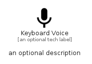

# KeyboardVoice


```text
material/Hardware/KeyboardVoice
```

```text
include('material/Hardware/KeyboardVoice')
```


| Illustration | KeyboardVoice |
| :---: | :---: |
|  |  |


## Sprites
The item provides the following sriptes:

- `<$KeyboardVoiceXs>`
- `<$KeyboardVoiceSm>`
- `<$KeyboardVoiceMd>`
- `<$KeyboardVoiceLg>`


## KeyboardVoice

### Load remotely
```plantuml
@startuml
' configures the library
!global $LIB_BASE_LOCATION="https://raw.githubusercontent.com/tmorin/plantuml-libs/master/distribution"

' loads the library's bootstrap
!include $LIB_BASE_LOCATION/bootstrap.puml

' loads the package bootstrap
include('material/bootstrap')

' loads the Item which embeds the element KeyboardVoice
include('material/Hardware/KeyboardVoice')

' renders the element
KeyboardVoice('KeyboardVoice', 'Keyboard Voice', 'an optional tech label', 'an optional description')
@enduml
```

### Load locally
```plantuml
@startuml
' configures the library
!global $INCLUSION_MODE="local"
!global $LIB_BASE_LOCATION="../.."

' loads the library's bootstrap
!include $LIB_BASE_LOCATION/bootstrap.puml

' loads the package bootstrap
include('material/bootstrap')

' loads the Item which embeds the element KeyboardVoice
include('material/Hardware/KeyboardVoice')

' renders the element
KeyboardVoice('KeyboardVoice', 'Keyboard Voice', 'an optional tech label', 'an optional description')
@enduml
```

