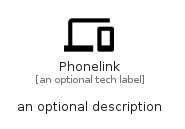

# Phonelink


```text
material/Hardware/Phonelink
```

```text
include('material/Hardware/Phonelink')
```


| Illustration | Phonelink |
| :---: | :---: |
|  |  |


## Sprites
The item provides the following sriptes:

- `<$PhonelinkXs>`
- `<$PhonelinkSm>`
- `<$PhonelinkMd>`
- `<$PhonelinkLg>`


## Phonelink

### Load remotely
```plantuml
@startuml
' configures the library
!global $LIB_BASE_LOCATION="https://raw.githubusercontent.com/tmorin/plantuml-libs/master/distribution"

' loads the library's bootstrap
!include $LIB_BASE_LOCATION/bootstrap.puml

' loads the package bootstrap
include('material/bootstrap')

' loads the Item which embeds the element Phonelink
include('material/Hardware/Phonelink')

' renders the element
Phonelink('Phonelink', 'Phonelink', 'an optional tech label', 'an optional description')
@enduml
```

### Load locally
```plantuml
@startuml
' configures the library
!global $INCLUSION_MODE="local"
!global $LIB_BASE_LOCATION="../.."

' loads the library's bootstrap
!include $LIB_BASE_LOCATION/bootstrap.puml

' loads the package bootstrap
include('material/bootstrap')

' loads the Item which embeds the element Phonelink
include('material/Hardware/Phonelink')

' renders the element
Phonelink('Phonelink', 'Phonelink', 'an optional tech label', 'an optional description')
@enduml
```

