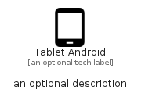

# TabletAndroid


```text
material/Hardware/TabletAndroid
```

```text
include('material/Hardware/TabletAndroid')
```


| Illustration | TabletAndroid |
| :---: | :---: |
|  |  |


## Sprites
The item provides the following sriptes:

- `<$TabletAndroidXs>`
- `<$TabletAndroidSm>`
- `<$TabletAndroidMd>`
- `<$TabletAndroidLg>`


## TabletAndroid

### Load remotely
```plantuml
@startuml
' configures the library
!global $LIB_BASE_LOCATION="https://raw.githubusercontent.com/tmorin/plantuml-libs/master/distribution"

' loads the library's bootstrap
!include $LIB_BASE_LOCATION/bootstrap.puml

' loads the package bootstrap
include('material/bootstrap')

' loads the Item which embeds the element TabletAndroid
include('material/Hardware/TabletAndroid')

' renders the element
TabletAndroid('TabletAndroid', 'Tablet Android', 'an optional tech label', 'an optional description')
@enduml
```

### Load locally
```plantuml
@startuml
' configures the library
!global $INCLUSION_MODE="local"
!global $LIB_BASE_LOCATION="../.."

' loads the library's bootstrap
!include $LIB_BASE_LOCATION/bootstrap.puml

' loads the package bootstrap
include('material/bootstrap')

' loads the Item which embeds the element TabletAndroid
include('material/Hardware/TabletAndroid')

' renders the element
TabletAndroid('TabletAndroid', 'Tablet Android', 'an optional tech label', 'an optional description')
@enduml
```

