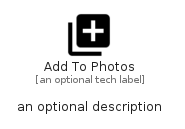

# AddToPhotos


```text
material/Image/AddToPhotos
```

```text
include('material/Image/AddToPhotos')
```


| Illustration | AddToPhotos |
| :---: | :---: |
|  |  |


## Sprites
The item provides the following sriptes:

- `<$AddToPhotosXs>`
- `<$AddToPhotosSm>`
- `<$AddToPhotosMd>`
- `<$AddToPhotosLg>`


## AddToPhotos

### Load remotely
```plantuml
@startuml
' configures the library
!global $LIB_BASE_LOCATION="https://raw.githubusercontent.com/tmorin/plantuml-libs/master/distribution"

' loads the library's bootstrap
!include $LIB_BASE_LOCATION/bootstrap.puml

' loads the package bootstrap
include('material/bootstrap')

' loads the Item which embeds the element AddToPhotos
include('material/Image/AddToPhotos')

' renders the element
AddToPhotos('AddToPhotos', 'Add To Photos', 'an optional tech label', 'an optional description')
@enduml
```

### Load locally
```plantuml
@startuml
' configures the library
!global $INCLUSION_MODE="local"
!global $LIB_BASE_LOCATION="../.."

' loads the library's bootstrap
!include $LIB_BASE_LOCATION/bootstrap.puml

' loads the package bootstrap
include('material/bootstrap')

' loads the Item which embeds the element AddToPhotos
include('material/Image/AddToPhotos')

' renders the element
AddToPhotos('AddToPhotos', 'Add To Photos', 'an optional tech label', 'an optional description')
@enduml
```

