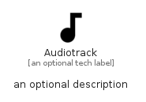

# Audiotrack


```text
material/Image/Audiotrack
```

```text
include('material/Image/Audiotrack')
```


| Illustration | Audiotrack |
| :---: | :---: |
|  |  |


## Sprites
The item provides the following sriptes:

- `<$AudiotrackXs>`
- `<$AudiotrackSm>`
- `<$AudiotrackMd>`
- `<$AudiotrackLg>`


## Audiotrack

### Load remotely
```plantuml
@startuml
' configures the library
!global $LIB_BASE_LOCATION="https://raw.githubusercontent.com/tmorin/plantuml-libs/master/distribution"

' loads the library's bootstrap
!include $LIB_BASE_LOCATION/bootstrap.puml

' loads the package bootstrap
include('material/bootstrap')

' loads the Item which embeds the element Audiotrack
include('material/Image/Audiotrack')

' renders the element
Audiotrack('Audiotrack', 'Audiotrack', 'an optional tech label', 'an optional description')
@enduml
```

### Load locally
```plantuml
@startuml
' configures the library
!global $INCLUSION_MODE="local"
!global $LIB_BASE_LOCATION="../.."

' loads the library's bootstrap
!include $LIB_BASE_LOCATION/bootstrap.puml

' loads the package bootstrap
include('material/bootstrap')

' loads the Item which embeds the element Audiotrack
include('material/Image/Audiotrack')

' renders the element
Audiotrack('Audiotrack', 'Audiotrack', 'an optional tech label', 'an optional description')
@enduml
```

