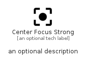

# CenterFocusStrong


```text
material/Image/CenterFocusStrong
```

```text
include('material/Image/CenterFocusStrong')
```


| Illustration | CenterFocusStrong |
| :---: | :---: |
|  |  |


## Sprites
The item provides the following sriptes:

- `<$CenterFocusStrongXs>`
- `<$CenterFocusStrongSm>`
- `<$CenterFocusStrongMd>`
- `<$CenterFocusStrongLg>`


## CenterFocusStrong

### Load remotely
```plantuml
@startuml
' configures the library
!global $LIB_BASE_LOCATION="https://raw.githubusercontent.com/tmorin/plantuml-libs/master/distribution"

' loads the library's bootstrap
!include $LIB_BASE_LOCATION/bootstrap.puml

' loads the package bootstrap
include('material/bootstrap')

' loads the Item which embeds the element CenterFocusStrong
include('material/Image/CenterFocusStrong')

' renders the element
CenterFocusStrong('CenterFocusStrong', 'Center Focus Strong', 'an optional tech label', 'an optional description')
@enduml
```

### Load locally
```plantuml
@startuml
' configures the library
!global $INCLUSION_MODE="local"
!global $LIB_BASE_LOCATION="../.."

' loads the library's bootstrap
!include $LIB_BASE_LOCATION/bootstrap.puml

' loads the package bootstrap
include('material/bootstrap')

' loads the Item which embeds the element CenterFocusStrong
include('material/Image/CenterFocusStrong')

' renders the element
CenterFocusStrong('CenterFocusStrong', 'Center Focus Strong', 'an optional tech label', 'an optional description')
@enduml
```

