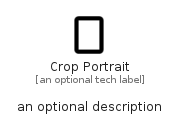

# CropPortrait


```text
material/Image/CropPortrait
```

```text
include('material/Image/CropPortrait')
```


| Illustration | CropPortrait |
| :---: | :---: |
|  |  |


## Sprites
The item provides the following sriptes:

- `<$CropPortraitXs>`
- `<$CropPortraitSm>`
- `<$CropPortraitMd>`
- `<$CropPortraitLg>`


## CropPortrait

### Load remotely
```plantuml
@startuml
' configures the library
!global $LIB_BASE_LOCATION="https://raw.githubusercontent.com/tmorin/plantuml-libs/master/distribution"

' loads the library's bootstrap
!include $LIB_BASE_LOCATION/bootstrap.puml

' loads the package bootstrap
include('material/bootstrap')

' loads the Item which embeds the element CropPortrait
include('material/Image/CropPortrait')

' renders the element
CropPortrait('CropPortrait', 'Crop Portrait', 'an optional tech label', 'an optional description')
@enduml
```

### Load locally
```plantuml
@startuml
' configures the library
!global $INCLUSION_MODE="local"
!global $LIB_BASE_LOCATION="../.."

' loads the library's bootstrap
!include $LIB_BASE_LOCATION/bootstrap.puml

' loads the package bootstrap
include('material/bootstrap')

' loads the Item which embeds the element CropPortrait
include('material/Image/CropPortrait')

' renders the element
CropPortrait('CropPortrait', 'Crop Portrait', 'an optional tech label', 'an optional description')
@enduml
```

