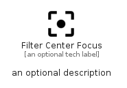

# FilterCenterFocus


```text
material/Image/FilterCenterFocus
```

```text
include('material/Image/FilterCenterFocus')
```


| Illustration | FilterCenterFocus |
| :---: | :---: |
|  |  |


## Sprites
The item provides the following sriptes:

- `<$FilterCenterFocusXs>`
- `<$FilterCenterFocusSm>`
- `<$FilterCenterFocusMd>`
- `<$FilterCenterFocusLg>`


## FilterCenterFocus

### Load remotely
```plantuml
@startuml
' configures the library
!global $LIB_BASE_LOCATION="https://raw.githubusercontent.com/tmorin/plantuml-libs/master/distribution"

' loads the library's bootstrap
!include $LIB_BASE_LOCATION/bootstrap.puml

' loads the package bootstrap
include('material/bootstrap')

' loads the Item which embeds the element FilterCenterFocus
include('material/Image/FilterCenterFocus')

' renders the element
FilterCenterFocus('FilterCenterFocus', 'Filter Center Focus', 'an optional tech label', 'an optional description')
@enduml
```

### Load locally
```plantuml
@startuml
' configures the library
!global $INCLUSION_MODE="local"
!global $LIB_BASE_LOCATION="../.."

' loads the library's bootstrap
!include $LIB_BASE_LOCATION/bootstrap.puml

' loads the package bootstrap
include('material/bootstrap')

' loads the Item which embeds the element FilterCenterFocus
include('material/Image/FilterCenterFocus')

' renders the element
FilterCenterFocus('FilterCenterFocus', 'Filter Center Focus', 'an optional tech label', 'an optional description')
@enduml
```

