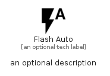

# FlashAuto


```text
material/Image/FlashAuto
```

```text
include('material/Image/FlashAuto')
```


| Illustration | FlashAuto |
| :---: | :---: |
|  |  |


## Sprites
The item provides the following sriptes:

- `<$FlashAutoXs>`
- `<$FlashAutoSm>`
- `<$FlashAutoMd>`
- `<$FlashAutoLg>`


## FlashAuto

### Load remotely
```plantuml
@startuml
' configures the library
!global $LIB_BASE_LOCATION="https://raw.githubusercontent.com/tmorin/plantuml-libs/master/distribution"

' loads the library's bootstrap
!include $LIB_BASE_LOCATION/bootstrap.puml

' loads the package bootstrap
include('material/bootstrap')

' loads the Item which embeds the element FlashAuto
include('material/Image/FlashAuto')

' renders the element
FlashAuto('FlashAuto', 'Flash Auto', 'an optional tech label', 'an optional description')
@enduml
```

### Load locally
```plantuml
@startuml
' configures the library
!global $INCLUSION_MODE="local"
!global $LIB_BASE_LOCATION="../.."

' loads the library's bootstrap
!include $LIB_BASE_LOCATION/bootstrap.puml

' loads the package bootstrap
include('material/bootstrap')

' loads the Item which embeds the element FlashAuto
include('material/Image/FlashAuto')

' renders the element
FlashAuto('FlashAuto', 'Flash Auto', 'an optional tech label', 'an optional description')
@enduml
```

