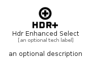

# HdrEnhancedSelect


```text
material/Image/HdrEnhancedSelect
```

```text
include('material/Image/HdrEnhancedSelect')
```


| Illustration | HdrEnhancedSelect |
| :---: | :---: |
|  |  |


## Sprites
The item provides the following sriptes:

- `<$HdrEnhancedSelectXs>`
- `<$HdrEnhancedSelectSm>`
- `<$HdrEnhancedSelectMd>`
- `<$HdrEnhancedSelectLg>`


## HdrEnhancedSelect

### Load remotely
```plantuml
@startuml
' configures the library
!global $LIB_BASE_LOCATION="https://raw.githubusercontent.com/tmorin/plantuml-libs/master/distribution"

' loads the library's bootstrap
!include $LIB_BASE_LOCATION/bootstrap.puml

' loads the package bootstrap
include('material/bootstrap')

' loads the Item which embeds the element HdrEnhancedSelect
include('material/Image/HdrEnhancedSelect')

' renders the element
HdrEnhancedSelect('HdrEnhancedSelect', 'Hdr Enhanced Select', 'an optional tech label', 'an optional description')
@enduml
```

### Load locally
```plantuml
@startuml
' configures the library
!global $INCLUSION_MODE="local"
!global $LIB_BASE_LOCATION="../.."

' loads the library's bootstrap
!include $LIB_BASE_LOCATION/bootstrap.puml

' loads the package bootstrap
include('material/bootstrap')

' loads the Item which embeds the element HdrEnhancedSelect
include('material/Image/HdrEnhancedSelect')

' renders the element
HdrEnhancedSelect('HdrEnhancedSelect', 'Hdr Enhanced Select', 'an optional tech label', 'an optional description')
@enduml
```

