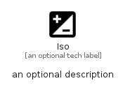

# Iso


```text
material/Image/Iso
```

```text
include('material/Image/Iso')
```


| Illustration | Iso |
| :---: | :---: |
|  |  |


## Sprites
The item provides the following sriptes:

- `<$IsoXs>`
- `<$IsoSm>`
- `<$IsoMd>`
- `<$IsoLg>`


## Iso

### Load remotely
```plantuml
@startuml
' configures the library
!global $LIB_BASE_LOCATION="https://raw.githubusercontent.com/tmorin/plantuml-libs/master/distribution"

' loads the library's bootstrap
!include $LIB_BASE_LOCATION/bootstrap.puml

' loads the package bootstrap
include('material/bootstrap')

' loads the Item which embeds the element Iso
include('material/Image/Iso')

' renders the element
Iso('Iso', 'Iso', 'an optional tech label', 'an optional description')
@enduml
```

### Load locally
```plantuml
@startuml
' configures the library
!global $INCLUSION_MODE="local"
!global $LIB_BASE_LOCATION="../.."

' loads the library's bootstrap
!include $LIB_BASE_LOCATION/bootstrap.puml

' loads the package bootstrap
include('material/bootstrap')

' loads the Item which embeds the element Iso
include('material/Image/Iso')

' renders the element
Iso('Iso', 'Iso', 'an optional tech label', 'an optional description')
@enduml
```

