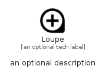

# Loupe


```text
material/Image/Loupe
```

```text
include('material/Image/Loupe')
```


| Illustration | Loupe |
| :---: | :---: |
|  |  |


## Sprites
The item provides the following sriptes:

- `<$LoupeXs>`
- `<$LoupeSm>`
- `<$LoupeMd>`
- `<$LoupeLg>`


## Loupe

### Load remotely
```plantuml
@startuml
' configures the library
!global $LIB_BASE_LOCATION="https://raw.githubusercontent.com/tmorin/plantuml-libs/master/distribution"

' loads the library's bootstrap
!include $LIB_BASE_LOCATION/bootstrap.puml

' loads the package bootstrap
include('material/bootstrap')

' loads the Item which embeds the element Loupe
include('material/Image/Loupe')

' renders the element
Loupe('Loupe', 'Loupe', 'an optional tech label', 'an optional description')
@enduml
```

### Load locally
```plantuml
@startuml
' configures the library
!global $INCLUSION_MODE="local"
!global $LIB_BASE_LOCATION="../.."

' loads the library's bootstrap
!include $LIB_BASE_LOCATION/bootstrap.puml

' loads the package bootstrap
include('material/bootstrap')

' loads the Item which embeds the element Loupe
include('material/Image/Loupe')

' renders the element
Loupe('Loupe', 'Loupe', 'an optional tech label', 'an optional description')
@enduml
```

