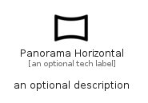

# PanoramaHorizontal


```text
material/Image/PanoramaHorizontal
```

```text
include('material/Image/PanoramaHorizontal')
```


| Illustration | PanoramaHorizontal |
| :---: | :---: |
|  |  |


## Sprites
The item provides the following sriptes:

- `<$PanoramaHorizontalXs>`
- `<$PanoramaHorizontalSm>`
- `<$PanoramaHorizontalMd>`
- `<$PanoramaHorizontalLg>`


## PanoramaHorizontal

### Load remotely
```plantuml
@startuml
' configures the library
!global $LIB_BASE_LOCATION="https://raw.githubusercontent.com/tmorin/plantuml-libs/master/distribution"

' loads the library's bootstrap
!include $LIB_BASE_LOCATION/bootstrap.puml

' loads the package bootstrap
include('material/bootstrap')

' loads the Item which embeds the element PanoramaHorizontal
include('material/Image/PanoramaHorizontal')

' renders the element
PanoramaHorizontal('PanoramaHorizontal', 'Panorama Horizontal', 'an optional tech label', 'an optional description')
@enduml
```

### Load locally
```plantuml
@startuml
' configures the library
!global $INCLUSION_MODE="local"
!global $LIB_BASE_LOCATION="../.."

' loads the library's bootstrap
!include $LIB_BASE_LOCATION/bootstrap.puml

' loads the package bootstrap
include('material/bootstrap')

' loads the Item which embeds the element PanoramaHorizontal
include('material/Image/PanoramaHorizontal')

' renders the element
PanoramaHorizontal('PanoramaHorizontal', 'Panorama Horizontal', 'an optional tech label', 'an optional description')
@enduml
```

