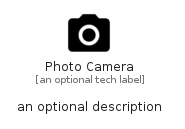

# PhotoCamera


```text
material/Image/PhotoCamera
```

```text
include('material/Image/PhotoCamera')
```


| Illustration | PhotoCamera |
| :---: | :---: |
|  |  |


## Sprites
The item provides the following sriptes:

- `<$PhotoCameraXs>`
- `<$PhotoCameraSm>`
- `<$PhotoCameraMd>`
- `<$PhotoCameraLg>`


## PhotoCamera

### Load remotely
```plantuml
@startuml
' configures the library
!global $LIB_BASE_LOCATION="https://raw.githubusercontent.com/tmorin/plantuml-libs/master/distribution"

' loads the library's bootstrap
!include $LIB_BASE_LOCATION/bootstrap.puml

' loads the package bootstrap
include('material/bootstrap')

' loads the Item which embeds the element PhotoCamera
include('material/Image/PhotoCamera')

' renders the element
PhotoCamera('PhotoCamera', 'Photo Camera', 'an optional tech label', 'an optional description')
@enduml
```

### Load locally
```plantuml
@startuml
' configures the library
!global $INCLUSION_MODE="local"
!global $LIB_BASE_LOCATION="../.."

' loads the library's bootstrap
!include $LIB_BASE_LOCATION/bootstrap.puml

' loads the package bootstrap
include('material/bootstrap')

' loads the Item which embeds the element PhotoCamera
include('material/Image/PhotoCamera')

' renders the element
PhotoCamera('PhotoCamera', 'Photo Camera', 'an optional tech label', 'an optional description')
@enduml
```

