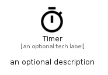

# Timer


```text
material/Image/Timer
```

```text
include('material/Image/Timer')
```


| Illustration | Timer |
| :---: | :---: |
|  |  |


## Sprites
The item provides the following sriptes:

- `<$TimerXs>`
- `<$TimerSm>`
- `<$TimerMd>`
- `<$TimerLg>`


## Timer

### Load remotely
```plantuml
@startuml
' configures the library
!global $LIB_BASE_LOCATION="https://raw.githubusercontent.com/tmorin/plantuml-libs/master/distribution"

' loads the library's bootstrap
!include $LIB_BASE_LOCATION/bootstrap.puml

' loads the package bootstrap
include('material/bootstrap')

' loads the Item which embeds the element Timer
include('material/Image/Timer')

' renders the element
Timer('Timer', 'Timer', 'an optional tech label', 'an optional description')
@enduml
```

### Load locally
```plantuml
@startuml
' configures the library
!global $INCLUSION_MODE="local"
!global $LIB_BASE_LOCATION="../.."

' loads the library's bootstrap
!include $LIB_BASE_LOCATION/bootstrap.puml

' loads the package bootstrap
include('material/bootstrap')

' loads the Item which embeds the element Timer
include('material/Image/Timer')

' renders the element
Timer('Timer', 'Timer', 'an optional tech label', 'an optional description')
@enduml
```

