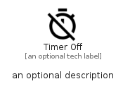

# TimerOff


```text
material/Image/TimerOff
```

```text
include('material/Image/TimerOff')
```


| Illustration | TimerOff |
| :---: | :---: |
|  |  |


## Sprites
The item provides the following sriptes:

- `<$TimerOffXs>`
- `<$TimerOffSm>`
- `<$TimerOffMd>`
- `<$TimerOffLg>`


## TimerOff

### Load remotely
```plantuml
@startuml
' configures the library
!global $LIB_BASE_LOCATION="https://raw.githubusercontent.com/tmorin/plantuml-libs/master/distribution"

' loads the library's bootstrap
!include $LIB_BASE_LOCATION/bootstrap.puml

' loads the package bootstrap
include('material/bootstrap')

' loads the Item which embeds the element TimerOff
include('material/Image/TimerOff')

' renders the element
TimerOff('TimerOff', 'Timer Off', 'an optional tech label', 'an optional description')
@enduml
```

### Load locally
```plantuml
@startuml
' configures the library
!global $INCLUSION_MODE="local"
!global $LIB_BASE_LOCATION="../.."

' loads the library's bootstrap
!include $LIB_BASE_LOCATION/bootstrap.puml

' loads the package bootstrap
include('material/bootstrap')

' loads the Item which embeds the element TimerOff
include('material/Image/TimerOff')

' renders the element
TimerOff('TimerOff', 'Timer Off', 'an optional tech label', 'an optional description')
@enduml
```

