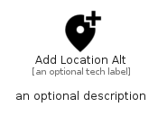

# AddLocationAlt


```text
material/Maps/AddLocationAlt
```

```text
include('material/Maps/AddLocationAlt')
```


| Illustration | AddLocationAlt |
| :---: | :---: |
|  |  |


## Sprites
The item provides the following sriptes:

- `<$AddLocationAltXs>`
- `<$AddLocationAltSm>`
- `<$AddLocationAltMd>`
- `<$AddLocationAltLg>`


## AddLocationAlt

### Load remotely
```plantuml
@startuml
' configures the library
!global $LIB_BASE_LOCATION="https://raw.githubusercontent.com/tmorin/plantuml-libs/master/distribution"

' loads the library's bootstrap
!include $LIB_BASE_LOCATION/bootstrap.puml

' loads the package bootstrap
include('material/bootstrap')

' loads the Item which embeds the element AddLocationAlt
include('material/Maps/AddLocationAlt')

' renders the element
AddLocationAlt('AddLocationAlt', 'Add Location Alt', 'an optional tech label', 'an optional description')
@enduml
```

### Load locally
```plantuml
@startuml
' configures the library
!global $INCLUSION_MODE="local"
!global $LIB_BASE_LOCATION="../.."

' loads the library's bootstrap
!include $LIB_BASE_LOCATION/bootstrap.puml

' loads the package bootstrap
include('material/bootstrap')

' loads the Item which embeds the element AddLocationAlt
include('material/Maps/AddLocationAlt')

' renders the element
AddLocationAlt('AddLocationAlt', 'Add Location Alt', 'an optional tech label', 'an optional description')
@enduml
```

