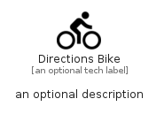

# DirectionsBike


```text
material/Maps/DirectionsBike
```

```text
include('material/Maps/DirectionsBike')
```


| Illustration | DirectionsBike |
| :---: | :---: |
|  |  |


## Sprites
The item provides the following sriptes:

- `<$DirectionsBikeXs>`
- `<$DirectionsBikeSm>`
- `<$DirectionsBikeMd>`
- `<$DirectionsBikeLg>`


## DirectionsBike

### Load remotely
```plantuml
@startuml
' configures the library
!global $LIB_BASE_LOCATION="https://raw.githubusercontent.com/tmorin/plantuml-libs/master/distribution"

' loads the library's bootstrap
!include $LIB_BASE_LOCATION/bootstrap.puml

' loads the package bootstrap
include('material/bootstrap')

' loads the Item which embeds the element DirectionsBike
include('material/Maps/DirectionsBike')

' renders the element
DirectionsBike('DirectionsBike', 'Directions Bike', 'an optional tech label', 'an optional description')
@enduml
```

### Load locally
```plantuml
@startuml
' configures the library
!global $INCLUSION_MODE="local"
!global $LIB_BASE_LOCATION="../.."

' loads the library's bootstrap
!include $LIB_BASE_LOCATION/bootstrap.puml

' loads the package bootstrap
include('material/bootstrap')

' loads the Item which embeds the element DirectionsBike
include('material/Maps/DirectionsBike')

' renders the element
DirectionsBike('DirectionsBike', 'Directions Bike', 'an optional tech label', 'an optional description')
@enduml
```

