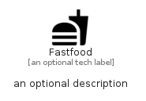

# Fastfood


```text
material/Maps/Fastfood
```

```text
include('material/Maps/Fastfood')
```


| Illustration | Fastfood |
| :---: | :---: |
|  |  |


## Sprites
The item provides the following sriptes:

- `<$FastfoodXs>`
- `<$FastfoodSm>`
- `<$FastfoodMd>`
- `<$FastfoodLg>`


## Fastfood

### Load remotely
```plantuml
@startuml
' configures the library
!global $LIB_BASE_LOCATION="https://raw.githubusercontent.com/tmorin/plantuml-libs/master/distribution"

' loads the library's bootstrap
!include $LIB_BASE_LOCATION/bootstrap.puml

' loads the package bootstrap
include('material/bootstrap')

' loads the Item which embeds the element Fastfood
include('material/Maps/Fastfood')

' renders the element
Fastfood('Fastfood', 'Fastfood', 'an optional tech label', 'an optional description')
@enduml
```

### Load locally
```plantuml
@startuml
' configures the library
!global $INCLUSION_MODE="local"
!global $LIB_BASE_LOCATION="../.."

' loads the library's bootstrap
!include $LIB_BASE_LOCATION/bootstrap.puml

' loads the package bootstrap
include('material/bootstrap')

' loads the Item which embeds the element Fastfood
include('material/Maps/Fastfood')

' renders the element
Fastfood('Fastfood', 'Fastfood', 'an optional tech label', 'an optional description')
@enduml
```

