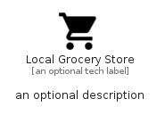

# LocalGroceryStore


```text
material/Maps/LocalGroceryStore
```

```text
include('material/Maps/LocalGroceryStore')
```


| Illustration | LocalGroceryStore |
| :---: | :---: |
|  |  |


## Sprites
The item provides the following sriptes:

- `<$LocalGroceryStoreXs>`
- `<$LocalGroceryStoreSm>`
- `<$LocalGroceryStoreMd>`
- `<$LocalGroceryStoreLg>`


## LocalGroceryStore

### Load remotely
```plantuml
@startuml
' configures the library
!global $LIB_BASE_LOCATION="https://raw.githubusercontent.com/tmorin/plantuml-libs/master/distribution"

' loads the library's bootstrap
!include $LIB_BASE_LOCATION/bootstrap.puml

' loads the package bootstrap
include('material/bootstrap')

' loads the Item which embeds the element LocalGroceryStore
include('material/Maps/LocalGroceryStore')

' renders the element
LocalGroceryStore('LocalGroceryStore', 'Local Grocery Store', 'an optional tech label', 'an optional description')
@enduml
```

### Load locally
```plantuml
@startuml
' configures the library
!global $INCLUSION_MODE="local"
!global $LIB_BASE_LOCATION="../.."

' loads the library's bootstrap
!include $LIB_BASE_LOCATION/bootstrap.puml

' loads the package bootstrap
include('material/bootstrap')

' loads the Item which embeds the element LocalGroceryStore
include('material/Maps/LocalGroceryStore')

' renders the element
LocalGroceryStore('LocalGroceryStore', 'Local Grocery Store', 'an optional tech label', 'an optional description')
@enduml
```

