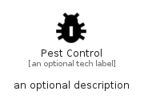

# PestControl


```text
material/Maps/PestControl
```

```text
include('material/Maps/PestControl')
```


| Illustration | PestControl |
| :---: | :---: |
|  |  |


## Sprites
The item provides the following sriptes:

- `<$PestControlXs>`
- `<$PestControlSm>`
- `<$PestControlMd>`
- `<$PestControlLg>`


## PestControl

### Load remotely
```plantuml
@startuml
' configures the library
!global $LIB_BASE_LOCATION="https://raw.githubusercontent.com/tmorin/plantuml-libs/master/distribution"

' loads the library's bootstrap
!include $LIB_BASE_LOCATION/bootstrap.puml

' loads the package bootstrap
include('material/bootstrap')

' loads the Item which embeds the element PestControl
include('material/Maps/PestControl')

' renders the element
PestControl('PestControl', 'Pest Control', 'an optional tech label', 'an optional description')
@enduml
```

### Load locally
```plantuml
@startuml
' configures the library
!global $INCLUSION_MODE="local"
!global $LIB_BASE_LOCATION="../.."

' loads the library's bootstrap
!include $LIB_BASE_LOCATION/bootstrap.puml

' loads the package bootstrap
include('material/bootstrap')

' loads the Item which embeds the element PestControl
include('material/Maps/PestControl')

' renders the element
PestControl('PestControl', 'Pest Control', 'an optional tech label', 'an optional description')
@enduml
```

