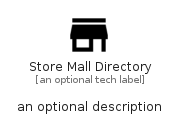

# StoreMallDirectory


```text
material/Maps/StoreMallDirectory
```

```text
include('material/Maps/StoreMallDirectory')
```


| Illustration | StoreMallDirectory |
| :---: | :---: |
|  |  |


## Sprites
The item provides the following sriptes:

- `<$StoreMallDirectoryXs>`
- `<$StoreMallDirectorySm>`
- `<$StoreMallDirectoryMd>`
- `<$StoreMallDirectoryLg>`


## StoreMallDirectory

### Load remotely
```plantuml
@startuml
' configures the library
!global $LIB_BASE_LOCATION="https://raw.githubusercontent.com/tmorin/plantuml-libs/master/distribution"

' loads the library's bootstrap
!include $LIB_BASE_LOCATION/bootstrap.puml

' loads the package bootstrap
include('material/bootstrap')

' loads the Item which embeds the element StoreMallDirectory
include('material/Maps/StoreMallDirectory')

' renders the element
StoreMallDirectory('StoreMallDirectory', 'Store Mall Directory', 'an optional tech label', 'an optional description')
@enduml
```

### Load locally
```plantuml
@startuml
' configures the library
!global $INCLUSION_MODE="local"
!global $LIB_BASE_LOCATION="../.."

' loads the library's bootstrap
!include $LIB_BASE_LOCATION/bootstrap.puml

' loads the package bootstrap
include('material/bootstrap')

' loads the Item which embeds the element StoreMallDirectory
include('material/Maps/StoreMallDirectory')

' renders the element
StoreMallDirectory('StoreMallDirectory', 'Store Mall Directory', 'an optional tech label', 'an optional description')
@enduml
```

