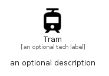

# Tram


```text
material/Maps/Tram
```

```text
include('material/Maps/Tram')
```


| Illustration | Tram |
| :---: | :---: |
|  |  |


## Sprites
The item provides the following sriptes:

- `<$TramXs>`
- `<$TramSm>`
- `<$TramMd>`
- `<$TramLg>`


## Tram

### Load remotely
```plantuml
@startuml
' configures the library
!global $LIB_BASE_LOCATION="https://raw.githubusercontent.com/tmorin/plantuml-libs/master/distribution"

' loads the library's bootstrap
!include $LIB_BASE_LOCATION/bootstrap.puml

' loads the package bootstrap
include('material/bootstrap')

' loads the Item which embeds the element Tram
include('material/Maps/Tram')

' renders the element
Tram('Tram', 'Tram', 'an optional tech label', 'an optional description')
@enduml
```

### Load locally
```plantuml
@startuml
' configures the library
!global $INCLUSION_MODE="local"
!global $LIB_BASE_LOCATION="../.."

' loads the library's bootstrap
!include $LIB_BASE_LOCATION/bootstrap.puml

' loads the package bootstrap
include('material/bootstrap')

' loads the Item which embeds the element Tram
include('material/Maps/Tram')

' renders the element
Tram('Tram', 'Tram', 'an optional tech label', 'an optional description')
@enduml
```

