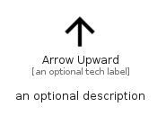

# ArrowUpward


```text
material/Navigation/ArrowUpward
```

```text
include('material/Navigation/ArrowUpward')
```


| Illustration | ArrowUpward |
| :---: | :---: |
|  |  |


## Sprites
The item provides the following sriptes:

- `<$ArrowUpwardXs>`
- `<$ArrowUpwardSm>`
- `<$ArrowUpwardMd>`
- `<$ArrowUpwardLg>`


## ArrowUpward

### Load remotely
```plantuml
@startuml
' configures the library
!global $LIB_BASE_LOCATION="https://raw.githubusercontent.com/tmorin/plantuml-libs/master/distribution"

' loads the library's bootstrap
!include $LIB_BASE_LOCATION/bootstrap.puml

' loads the package bootstrap
include('material/bootstrap')

' loads the Item which embeds the element ArrowUpward
include('material/Navigation/ArrowUpward')

' renders the element
ArrowUpward('ArrowUpward', 'Arrow Upward', 'an optional tech label', 'an optional description')
@enduml
```

### Load locally
```plantuml
@startuml
' configures the library
!global $INCLUSION_MODE="local"
!global $LIB_BASE_LOCATION="../.."

' loads the library's bootstrap
!include $LIB_BASE_LOCATION/bootstrap.puml

' loads the package bootstrap
include('material/bootstrap')

' loads the Item which embeds the element ArrowUpward
include('material/Navigation/ArrowUpward')

' renders the element
ArrowUpward('ArrowUpward', 'Arrow Upward', 'an optional tech label', 'an optional description')
@enduml
```

