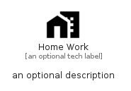

# HomeWork


```text
material/Navigation/HomeWork
```

```text
include('material/Navigation/HomeWork')
```


| Illustration | HomeWork |
| :---: | :---: |
|  |  |


## Sprites
The item provides the following sriptes:

- `<$HomeWorkXs>`
- `<$HomeWorkSm>`
- `<$HomeWorkMd>`
- `<$HomeWorkLg>`


## HomeWork

### Load remotely
```plantuml
@startuml
' configures the library
!global $LIB_BASE_LOCATION="https://raw.githubusercontent.com/tmorin/plantuml-libs/master/distribution"

' loads the library's bootstrap
!include $LIB_BASE_LOCATION/bootstrap.puml

' loads the package bootstrap
include('material/bootstrap')

' loads the Item which embeds the element HomeWork
include('material/Navigation/HomeWork')

' renders the element
HomeWork('HomeWork', 'Home Work', 'an optional tech label', 'an optional description')
@enduml
```

### Load locally
```plantuml
@startuml
' configures the library
!global $INCLUSION_MODE="local"
!global $LIB_BASE_LOCATION="../.."

' loads the library's bootstrap
!include $LIB_BASE_LOCATION/bootstrap.puml

' loads the package bootstrap
include('material/bootstrap')

' loads the Item which embeds the element HomeWork
include('material/Navigation/HomeWork')

' renders the element
HomeWork('HomeWork', 'Home Work', 'an optional tech label', 'an optional description')
@enduml
```

