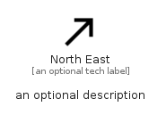

# NorthEast


```text
material/Navigation/NorthEast
```

```text
include('material/Navigation/NorthEast')
```


| Illustration | NorthEast |
| :---: | :---: |
|  |  |


## Sprites
The item provides the following sriptes:

- `<$NorthEastXs>`
- `<$NorthEastSm>`
- `<$NorthEastMd>`
- `<$NorthEastLg>`


## NorthEast

### Load remotely
```plantuml
@startuml
' configures the library
!global $LIB_BASE_LOCATION="https://raw.githubusercontent.com/tmorin/plantuml-libs/master/distribution"

' loads the library's bootstrap
!include $LIB_BASE_LOCATION/bootstrap.puml

' loads the package bootstrap
include('material/bootstrap')

' loads the Item which embeds the element NorthEast
include('material/Navigation/NorthEast')

' renders the element
NorthEast('NorthEast', 'North East', 'an optional tech label', 'an optional description')
@enduml
```

### Load locally
```plantuml
@startuml
' configures the library
!global $INCLUSION_MODE="local"
!global $LIB_BASE_LOCATION="../.."

' loads the library's bootstrap
!include $LIB_BASE_LOCATION/bootstrap.puml

' loads the package bootstrap
include('material/bootstrap')

' loads the Item which embeds the element NorthEast
include('material/Navigation/NorthEast')

' renders the element
NorthEast('NorthEast', 'North East', 'an optional tech label', 'an optional description')
@enduml
```

