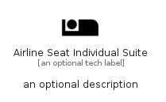

# AirlineSeatIndividualSuite


```text
material/Notification/AirlineSeatIndividualSuite
```

```text
include('material/Notification/AirlineSeatIndividualSuite')
```


| Illustration | AirlineSeatIndividualSuite |
| :---: | :---: |
|  |  |


## Sprites
The item provides the following sriptes:

- `<$AirlineSeatIndividualSuiteXs>`
- `<$AirlineSeatIndividualSuiteSm>`
- `<$AirlineSeatIndividualSuiteMd>`
- `<$AirlineSeatIndividualSuiteLg>`


## AirlineSeatIndividualSuite

### Load remotely
```plantuml
@startuml
' configures the library
!global $LIB_BASE_LOCATION="https://raw.githubusercontent.com/tmorin/plantuml-libs/master/distribution"

' loads the library's bootstrap
!include $LIB_BASE_LOCATION/bootstrap.puml

' loads the package bootstrap
include('material/bootstrap')

' loads the Item which embeds the element AirlineSeatIndividualSuite
include('material/Notification/AirlineSeatIndividualSuite')

' renders the element
AirlineSeatIndividualSuite('AirlineSeatIndividualSuite', 'Airline Seat Individual Suite', 'an optional tech label', 'an optional description')
@enduml
```

### Load locally
```plantuml
@startuml
' configures the library
!global $INCLUSION_MODE="local"
!global $LIB_BASE_LOCATION="../.."

' loads the library's bootstrap
!include $LIB_BASE_LOCATION/bootstrap.puml

' loads the package bootstrap
include('material/bootstrap')

' loads the Item which embeds the element AirlineSeatIndividualSuite
include('material/Notification/AirlineSeatIndividualSuite')

' renders the element
AirlineSeatIndividualSuite('AirlineSeatIndividualSuite', 'Airline Seat Individual Suite', 'an optional tech label', 'an optional description')
@enduml
```

