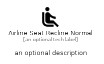

# AirlineSeatReclineNormal


```text
material/Notification/AirlineSeatReclineNormal
```

```text
include('material/Notification/AirlineSeatReclineNormal')
```


| Illustration | AirlineSeatReclineNormal |
| :---: | :---: |
|  |  |


## Sprites
The item provides the following sriptes:

- `<$AirlineSeatReclineNormalXs>`
- `<$AirlineSeatReclineNormalSm>`
- `<$AirlineSeatReclineNormalMd>`
- `<$AirlineSeatReclineNormalLg>`


## AirlineSeatReclineNormal

### Load remotely
```plantuml
@startuml
' configures the library
!global $LIB_BASE_LOCATION="https://raw.githubusercontent.com/tmorin/plantuml-libs/master/distribution"

' loads the library's bootstrap
!include $LIB_BASE_LOCATION/bootstrap.puml

' loads the package bootstrap
include('material/bootstrap')

' loads the Item which embeds the element AirlineSeatReclineNormal
include('material/Notification/AirlineSeatReclineNormal')

' renders the element
AirlineSeatReclineNormal('AirlineSeatReclineNormal', 'Airline Seat Recline Normal', 'an optional tech label', 'an optional description')
@enduml
```

### Load locally
```plantuml
@startuml
' configures the library
!global $INCLUSION_MODE="local"
!global $LIB_BASE_LOCATION="../.."

' loads the library's bootstrap
!include $LIB_BASE_LOCATION/bootstrap.puml

' loads the package bootstrap
include('material/bootstrap')

' loads the Item which embeds the element AirlineSeatReclineNormal
include('material/Notification/AirlineSeatReclineNormal')

' renders the element
AirlineSeatReclineNormal('AirlineSeatReclineNormal', 'Airline Seat Recline Normal', 'an optional tech label', 'an optional description')
@enduml
```

