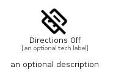

# DirectionsOff


```text
material/Notification/DirectionsOff
```

```text
include('material/Notification/DirectionsOff')
```


| Illustration | DirectionsOff |
| :---: | :---: |
|  |  |


## Sprites
The item provides the following sriptes:

- `<$DirectionsOffXs>`
- `<$DirectionsOffSm>`
- `<$DirectionsOffMd>`
- `<$DirectionsOffLg>`


## DirectionsOff

### Load remotely
```plantuml
@startuml
' configures the library
!global $LIB_BASE_LOCATION="https://raw.githubusercontent.com/tmorin/plantuml-libs/master/distribution"

' loads the library's bootstrap
!include $LIB_BASE_LOCATION/bootstrap.puml

' loads the package bootstrap
include('material/bootstrap')

' loads the Item which embeds the element DirectionsOff
include('material/Notification/DirectionsOff')

' renders the element
DirectionsOff('DirectionsOff', 'Directions Off', 'an optional tech label', 'an optional description')
@enduml
```

### Load locally
```plantuml
@startuml
' configures the library
!global $INCLUSION_MODE="local"
!global $LIB_BASE_LOCATION="../.."

' loads the library's bootstrap
!include $LIB_BASE_LOCATION/bootstrap.puml

' loads the package bootstrap
include('material/bootstrap')

' loads the Item which embeds the element DirectionsOff
include('material/Notification/DirectionsOff')

' renders the element
DirectionsOff('DirectionsOff', 'Directions Off', 'an optional tech label', 'an optional description')
@enduml
```

