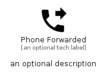

# PhoneForwarded


```text
material/Notification/PhoneForwarded
```

```text
include('material/Notification/PhoneForwarded')
```


| Illustration | PhoneForwarded |
| :---: | :---: |
|  |  |


## Sprites
The item provides the following sriptes:

- `<$PhoneForwardedXs>`
- `<$PhoneForwardedSm>`
- `<$PhoneForwardedMd>`
- `<$PhoneForwardedLg>`


## PhoneForwarded

### Load remotely
```plantuml
@startuml
' configures the library
!global $LIB_BASE_LOCATION="https://raw.githubusercontent.com/tmorin/plantuml-libs/master/distribution"

' loads the library's bootstrap
!include $LIB_BASE_LOCATION/bootstrap.puml

' loads the package bootstrap
include('material/bootstrap')

' loads the Item which embeds the element PhoneForwarded
include('material/Notification/PhoneForwarded')

' renders the element
PhoneForwarded('PhoneForwarded', 'Phone Forwarded', 'an optional tech label', 'an optional description')
@enduml
```

### Load locally
```plantuml
@startuml
' configures the library
!global $INCLUSION_MODE="local"
!global $LIB_BASE_LOCATION="../.."

' loads the library's bootstrap
!include $LIB_BASE_LOCATION/bootstrap.puml

' loads the package bootstrap
include('material/bootstrap')

' loads the Item which embeds the element PhoneForwarded
include('material/Notification/PhoneForwarded')

' renders the element
PhoneForwarded('PhoneForwarded', 'Phone Forwarded', 'an optional tech label', 'an optional description')
@enduml
```

