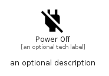

# PowerOff


```text
material/Notification/PowerOff
```

```text
include('material/Notification/PowerOff')
```


| Illustration | PowerOff |
| :---: | :---: |
|  |  |


## Sprites
The item provides the following sriptes:

- `<$PowerOffXs>`
- `<$PowerOffSm>`
- `<$PowerOffMd>`
- `<$PowerOffLg>`


## PowerOff

### Load remotely
```plantuml
@startuml
' configures the library
!global $LIB_BASE_LOCATION="https://raw.githubusercontent.com/tmorin/plantuml-libs/master/distribution"

' loads the library's bootstrap
!include $LIB_BASE_LOCATION/bootstrap.puml

' loads the package bootstrap
include('material/bootstrap')

' loads the Item which embeds the element PowerOff
include('material/Notification/PowerOff')

' renders the element
PowerOff('PowerOff', 'Power Off', 'an optional tech label', 'an optional description')
@enduml
```

### Load locally
```plantuml
@startuml
' configures the library
!global $INCLUSION_MODE="local"
!global $LIB_BASE_LOCATION="../.."

' loads the library's bootstrap
!include $LIB_BASE_LOCATION/bootstrap.puml

' loads the package bootstrap
include('material/bootstrap')

' loads the Item which embeds the element PowerOff
include('material/Notification/PowerOff')

' renders the element
PowerOff('PowerOff', 'Power Off', 'an optional tech label', 'an optional description')
@enduml
```

