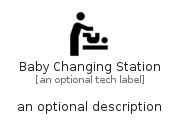

# BabyChangingStation


```text
material/Places/BabyChangingStation
```

```text
include('material/Places/BabyChangingStation')
```


| Illustration | BabyChangingStation |
| :---: | :---: |
|  |  |


## Sprites
The item provides the following sriptes:

- `<$BabyChangingStationXs>`
- `<$BabyChangingStationSm>`
- `<$BabyChangingStationMd>`
- `<$BabyChangingStationLg>`


## BabyChangingStation

### Load remotely
```plantuml
@startuml
' configures the library
!global $LIB_BASE_LOCATION="https://raw.githubusercontent.com/tmorin/plantuml-libs/master/distribution"

' loads the library's bootstrap
!include $LIB_BASE_LOCATION/bootstrap.puml

' loads the package bootstrap
include('material/bootstrap')

' loads the Item which embeds the element BabyChangingStation
include('material/Places/BabyChangingStation')

' renders the element
BabyChangingStation('BabyChangingStation', 'Baby Changing Station', 'an optional tech label', 'an optional description')
@enduml
```

### Load locally
```plantuml
@startuml
' configures the library
!global $INCLUSION_MODE="local"
!global $LIB_BASE_LOCATION="../.."

' loads the library's bootstrap
!include $LIB_BASE_LOCATION/bootstrap.puml

' loads the package bootstrap
include('material/bootstrap')

' loads the Item which embeds the element BabyChangingStation
include('material/Places/BabyChangingStation')

' renders the element
BabyChangingStation('BabyChangingStation', 'Baby Changing Station', 'an optional tech label', 'an optional description')
@enduml
```

