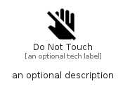

# DoNotTouch


```text
material/Places/DoNotTouch
```

```text
include('material/Places/DoNotTouch')
```


| Illustration | DoNotTouch |
| :---: | :---: |
|  |  |


## Sprites
The item provides the following sriptes:

- `<$DoNotTouchXs>`
- `<$DoNotTouchSm>`
- `<$DoNotTouchMd>`
- `<$DoNotTouchLg>`


## DoNotTouch

### Load remotely
```plantuml
@startuml
' configures the library
!global $LIB_BASE_LOCATION="https://raw.githubusercontent.com/tmorin/plantuml-libs/master/distribution"

' loads the library's bootstrap
!include $LIB_BASE_LOCATION/bootstrap.puml

' loads the package bootstrap
include('material/bootstrap')

' loads the Item which embeds the element DoNotTouch
include('material/Places/DoNotTouch')

' renders the element
DoNotTouch('DoNotTouch', 'Do Not Touch', 'an optional tech label', 'an optional description')
@enduml
```

### Load locally
```plantuml
@startuml
' configures the library
!global $INCLUSION_MODE="local"
!global $LIB_BASE_LOCATION="../.."

' loads the library's bootstrap
!include $LIB_BASE_LOCATION/bootstrap.puml

' loads the package bootstrap
include('material/bootstrap')

' loads the Item which embeds the element DoNotTouch
include('material/Places/DoNotTouch')

' renders the element
DoNotTouch('DoNotTouch', 'Do Not Touch', 'an optional tech label', 'an optional description')
@enduml
```

