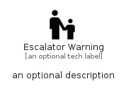

# EscalatorWarning


```text
material/Places/EscalatorWarning
```

```text
include('material/Places/EscalatorWarning')
```


| Illustration | EscalatorWarning |
| :---: | :---: |
|  |  |


## Sprites
The item provides the following sriptes:

- `<$EscalatorWarningXs>`
- `<$EscalatorWarningSm>`
- `<$EscalatorWarningMd>`
- `<$EscalatorWarningLg>`


## EscalatorWarning

### Load remotely
```plantuml
@startuml
' configures the library
!global $LIB_BASE_LOCATION="https://raw.githubusercontent.com/tmorin/plantuml-libs/master/distribution"

' loads the library's bootstrap
!include $LIB_BASE_LOCATION/bootstrap.puml

' loads the package bootstrap
include('material/bootstrap')

' loads the Item which embeds the element EscalatorWarning
include('material/Places/EscalatorWarning')

' renders the element
EscalatorWarning('EscalatorWarning', 'Escalator Warning', 'an optional tech label', 'an optional description')
@enduml
```

### Load locally
```plantuml
@startuml
' configures the library
!global $INCLUSION_MODE="local"
!global $LIB_BASE_LOCATION="../.."

' loads the library's bootstrap
!include $LIB_BASE_LOCATION/bootstrap.puml

' loads the package bootstrap
include('material/bootstrap')

' loads the Item which embeds the element EscalatorWarning
include('material/Places/EscalatorWarning')

' renders the element
EscalatorWarning('EscalatorWarning', 'Escalator Warning', 'an optional tech label', 'an optional description')
@enduml
```

