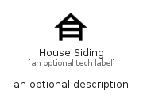

# HouseSiding


```text
material/Places/HouseSiding
```

```text
include('material/Places/HouseSiding')
```


| Illustration | HouseSiding |
| :---: | :---: |
|  |  |


## Sprites
The item provides the following sriptes:

- `<$HouseSidingXs>`
- `<$HouseSidingSm>`
- `<$HouseSidingMd>`
- `<$HouseSidingLg>`


## HouseSiding

### Load remotely
```plantuml
@startuml
' configures the library
!global $LIB_BASE_LOCATION="https://raw.githubusercontent.com/tmorin/plantuml-libs/master/distribution"

' loads the library's bootstrap
!include $LIB_BASE_LOCATION/bootstrap.puml

' loads the package bootstrap
include('material/bootstrap')

' loads the Item which embeds the element HouseSiding
include('material/Places/HouseSiding')

' renders the element
HouseSiding('HouseSiding', 'House Siding', 'an optional tech label', 'an optional description')
@enduml
```

### Load locally
```plantuml
@startuml
' configures the library
!global $INCLUSION_MODE="local"
!global $LIB_BASE_LOCATION="../.."

' loads the library's bootstrap
!include $LIB_BASE_LOCATION/bootstrap.puml

' loads the package bootstrap
include('material/bootstrap')

' loads the Item which embeds the element HouseSiding
include('material/Places/HouseSiding')

' renders the element
HouseSiding('HouseSiding', 'House Siding', 'an optional tech label', 'an optional description')
@enduml
```

