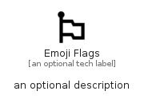

# EmojiFlags


```text
material/Social/EmojiFlags
```

```text
include('material/Social/EmojiFlags')
```


| Illustration | EmojiFlags |
| :---: | :---: |
|  |  |


## Sprites
The item provides the following sriptes:

- `<$EmojiFlagsXs>`
- `<$EmojiFlagsSm>`
- `<$EmojiFlagsMd>`
- `<$EmojiFlagsLg>`


## EmojiFlags

### Load remotely
```plantuml
@startuml
' configures the library
!global $LIB_BASE_LOCATION="https://raw.githubusercontent.com/tmorin/plantuml-libs/master/distribution"

' loads the library's bootstrap
!include $LIB_BASE_LOCATION/bootstrap.puml

' loads the package bootstrap
include('material/bootstrap')

' loads the Item which embeds the element EmojiFlags
include('material/Social/EmojiFlags')

' renders the element
EmojiFlags('EmojiFlags', 'Emoji Flags', 'an optional tech label', 'an optional description')
@enduml
```

### Load locally
```plantuml
@startuml
' configures the library
!global $INCLUSION_MODE="local"
!global $LIB_BASE_LOCATION="../.."

' loads the library's bootstrap
!include $LIB_BASE_LOCATION/bootstrap.puml

' loads the package bootstrap
include('material/bootstrap')

' loads the Item which embeds the element EmojiFlags
include('material/Social/EmojiFlags')

' renders the element
EmojiFlags('EmojiFlags', 'Emoji Flags', 'an optional tech label', 'an optional description')
@enduml
```

