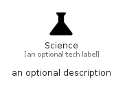

# Science


```text
material/Social/Science
```

```text
include('material/Social/Science')
```


| Illustration | Science |
| :---: | :---: |
|  |  |


## Sprites
The item provides the following sriptes:

- `<$ScienceXs>`
- `<$ScienceSm>`
- `<$ScienceMd>`
- `<$ScienceLg>`


## Science

### Load remotely
```plantuml
@startuml
' configures the library
!global $LIB_BASE_LOCATION="https://raw.githubusercontent.com/tmorin/plantuml-libs/master/distribution"

' loads the library's bootstrap
!include $LIB_BASE_LOCATION/bootstrap.puml

' loads the package bootstrap
include('material/bootstrap')

' loads the Item which embeds the element Science
include('material/Social/Science')

' renders the element
Science('Science', 'Science', 'an optional tech label', 'an optional description')
@enduml
```

### Load locally
```plantuml
@startuml
' configures the library
!global $INCLUSION_MODE="local"
!global $LIB_BASE_LOCATION="../.."

' loads the library's bootstrap
!include $LIB_BASE_LOCATION/bootstrap.puml

' loads the package bootstrap
include('material/bootstrap')

' loads the Item which embeds the element Science
include('material/Social/Science')

' renders the element
Science('Science', 'Science', 'an optional tech label', 'an optional description')
@enduml
```

