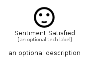

# SentimentSatisfied


```text
material/Social/SentimentSatisfied
```

```text
include('material/Social/SentimentSatisfied')
```


| Illustration | SentimentSatisfied |
| :---: | :---: |
|  |  |


## Sprites
The item provides the following sriptes:

- `<$SentimentSatisfiedXs>`
- `<$SentimentSatisfiedSm>`
- `<$SentimentSatisfiedMd>`
- `<$SentimentSatisfiedLg>`


## SentimentSatisfied

### Load remotely
```plantuml
@startuml
' configures the library
!global $LIB_BASE_LOCATION="https://raw.githubusercontent.com/tmorin/plantuml-libs/master/distribution"

' loads the library's bootstrap
!include $LIB_BASE_LOCATION/bootstrap.puml

' loads the package bootstrap
include('material/bootstrap')

' loads the Item which embeds the element SentimentSatisfied
include('material/Social/SentimentSatisfied')

' renders the element
SentimentSatisfied('SentimentSatisfied', 'Sentiment Satisfied', 'an optional tech label', 'an optional description')
@enduml
```

### Load locally
```plantuml
@startuml
' configures the library
!global $INCLUSION_MODE="local"
!global $LIB_BASE_LOCATION="../.."

' loads the library's bootstrap
!include $LIB_BASE_LOCATION/bootstrap.puml

' loads the package bootstrap
include('material/bootstrap')

' loads the Item which embeds the element SentimentSatisfied
include('material/Social/SentimentSatisfied')

' renders the element
SentimentSatisfied('SentimentSatisfied', 'Sentiment Satisfied', 'an optional tech label', 'an optional description')
@enduml
```

