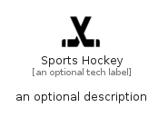

# SportsHockey


```text
material/Social/SportsHockey
```

```text
include('material/Social/SportsHockey')
```


| Illustration | SportsHockey |
| :---: | :---: |
|  |  |


## Sprites
The item provides the following sriptes:

- `<$SportsHockeyXs>`
- `<$SportsHockeySm>`
- `<$SportsHockeyMd>`
- `<$SportsHockeyLg>`


## SportsHockey

### Load remotely
```plantuml
@startuml
' configures the library
!global $LIB_BASE_LOCATION="https://raw.githubusercontent.com/tmorin/plantuml-libs/master/distribution"

' loads the library's bootstrap
!include $LIB_BASE_LOCATION/bootstrap.puml

' loads the package bootstrap
include('material/bootstrap')

' loads the Item which embeds the element SportsHockey
include('material/Social/SportsHockey')

' renders the element
SportsHockey('SportsHockey', 'Sports Hockey', 'an optional tech label', 'an optional description')
@enduml
```

### Load locally
```plantuml
@startuml
' configures the library
!global $INCLUSION_MODE="local"
!global $LIB_BASE_LOCATION="../.."

' loads the library's bootstrap
!include $LIB_BASE_LOCATION/bootstrap.puml

' loads the package bootstrap
include('material/bootstrap')

' loads the Item which embeds the element SportsHockey
include('material/Social/SportsHockey')

' renders the element
SportsHockey('SportsHockey', 'Sports Hockey', 'an optional tech label', 'an optional description')
@enduml
```

