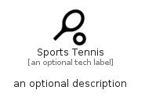

# SportsTennis


```text
material/Social/SportsTennis
```

```text
include('material/Social/SportsTennis')
```


| Illustration | SportsTennis |
| :---: | :---: |
|  |  |


## Sprites
The item provides the following sriptes:

- `<$SportsTennisXs>`
- `<$SportsTennisSm>`
- `<$SportsTennisMd>`
- `<$SportsTennisLg>`


## SportsTennis

### Load remotely
```plantuml
@startuml
' configures the library
!global $LIB_BASE_LOCATION="https://raw.githubusercontent.com/tmorin/plantuml-libs/master/distribution"

' loads the library's bootstrap
!include $LIB_BASE_LOCATION/bootstrap.puml

' loads the package bootstrap
include('material/bootstrap')

' loads the Item which embeds the element SportsTennis
include('material/Social/SportsTennis')

' renders the element
SportsTennis('SportsTennis', 'Sports Tennis', 'an optional tech label', 'an optional description')
@enduml
```

### Load locally
```plantuml
@startuml
' configures the library
!global $INCLUSION_MODE="local"
!global $LIB_BASE_LOCATION="../.."

' loads the library's bootstrap
!include $LIB_BASE_LOCATION/bootstrap.puml

' loads the package bootstrap
include('material/bootstrap')

' loads the Item which embeds the element SportsTennis
include('material/Social/SportsTennis')

' renders the element
SportsTennis('SportsTennis', 'Sports Tennis', 'an optional tech label', 'an optional description')
@enduml
```

